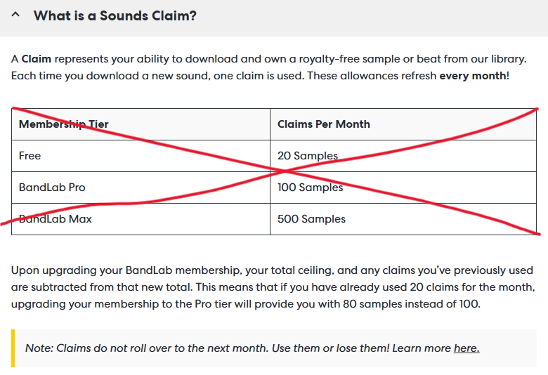

[CURRENTLY WAITING FOR IT TO REACH CHROME WEB STORE!!!]

# bandlab sample downloader

simply grants the ability to freely download bandlab samples again! no more credit system :)

## disclaimer

we don't support this!!

## ui preview

## disclaimer #2 

i really don't like the system so i quickly made this extension for people that like bandlab loops and don't wanna pay. 

if you want this taken down contact my github.

## technologies & tools used

### extension framework
- **manifest v3** — chrome extension manifest format (mv3 with service workers instead of background pages)
- **javascript (es2020+)** — async/await, arrow functions, template literals, map/set, destructuring, optional chaining, nullish coalescing

### apis used

#### chrome extension apis:
- `chrome.downloads.download` — triggers file downloads with saveAs: true for save dialog
- `chrome.storage.local` — persists layout position/size, download queue, favourites, welcome screen state
- `chrome.storage.session` — in-memory flag passing that survives page navigation (mv3 only)
- `chrome.runtime.sendMessage` / `onMessage` — communication between content script and service worker
- `chrome.webRequest.onBeforeRequest` — intercepts audio file requests to capture urls
- `chrome.scripting.executeScript` — injects audio url interceptor into the main world (bypasses content script isolation)
- `chrome.tabs.sendMessage` — service worker broadcasts download queue updates to content script

#### web apis:
- **xmlhttprequest** with `responseType: 'blob'` and `withCredentials: true` — fetches audio files cross-origin (bypasses cors via host_permissions)
- **mutationobserver** — watches dom for new/lazy-loaded sample elements with 250ms debounce
- **url.createObjectURL** / **url.revokeObjectURL** — creates blob urls for zip download
- **history.replaceState** — cleans auto-download url flags/hashes after use
- **sessionStorage** — original auto-download flag passing mechanism
- **window.postMessage** — receives captured audio urls from the main world interceptor

### third-party library
- **jszip v3.10.1** (jszip.min.js) — creates zip archives in-browser from fetched audio blobs

### bandlab-specific knowledge
- **url pattern**: `https://static.bandlab.com/loops-original/{UUID}/{UUID}.wav`
- **dom selectors**: `.sounds-loop`, `.sounds-explore-pack`, `.sounds-pack-header-title`, `.sounds-pack-header-image`
- **sample id extraction** from `a[href*="sampleId"]` links
- **spa framework**: bandlab is an angularjs spa (html5 history api routing, no hash routing)
- **audio metadata** extracted from: `.sounds-loop-tempo`, `.sounds-loop-key`, `.sounds-loop-genres`, `.sounds-loop-characters`, `.sounds-loop-instrument`

### design / ui
- **dark theme** (#141414 background, #e53935 bandlab red accent)
- **floating draggable/resizable panel** with position/size persistence
- **inline svg icons** (no external icon files except pack images)
- **css custom properties** + isolated styles via scoped `#bl-panel *` rules
- **progress bar** for zip creation (fetch count + generation percentage)
- **toast notifications** (auto-dismiss after 2.5s)

### architectural patterns
- **content script** handles all ui, dom scanning, zip creation — runs at document_start
- **service worker** handles download queue, file downloads via chrome api, audio url interception — lightweight, stateless
- **four-channel auto-download flag** (priority order): `chrome.storage.session` (init async) → `location.hash` captured at document_start → `sessionStorage` → `chrome.storage.local`
- **60-second blob url retention** before revocation
- **throttled progress updates** (120ms minimum interval) to prevent rapid visual flickering
- **parallel file fetching** with Promise.all (browser manages 6 concurrent connections per domain)
- **error resilience**: failed/skipped files don't block zip; individual `chrome.downloads.download` fallback on complete zip failure
